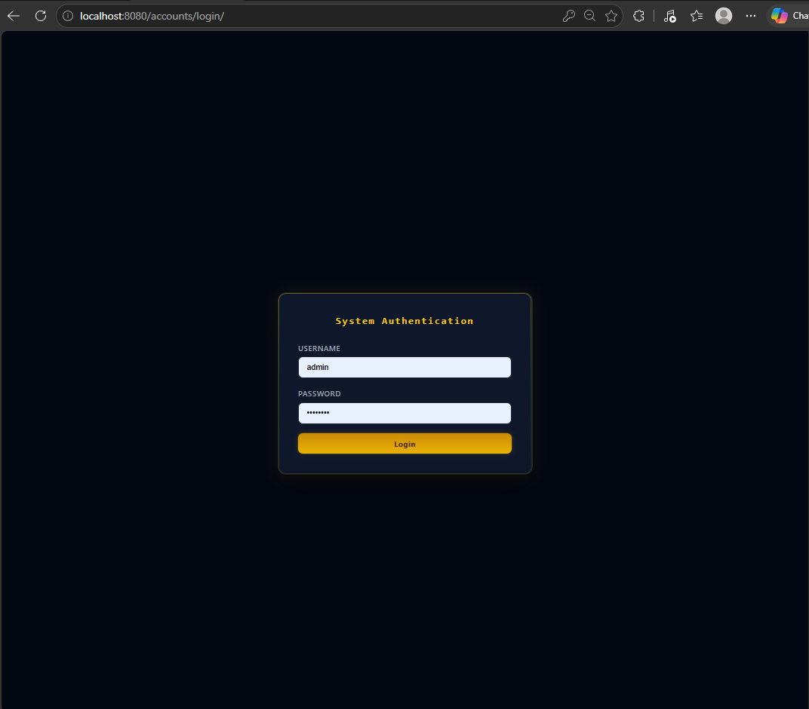
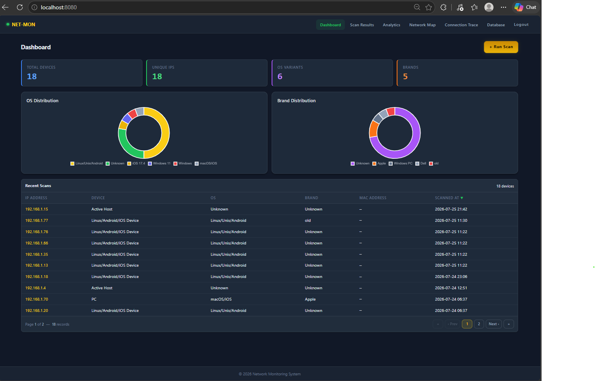
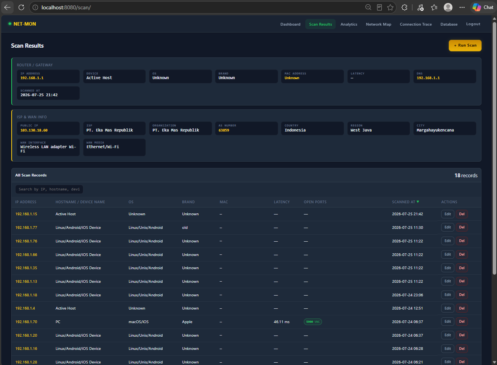
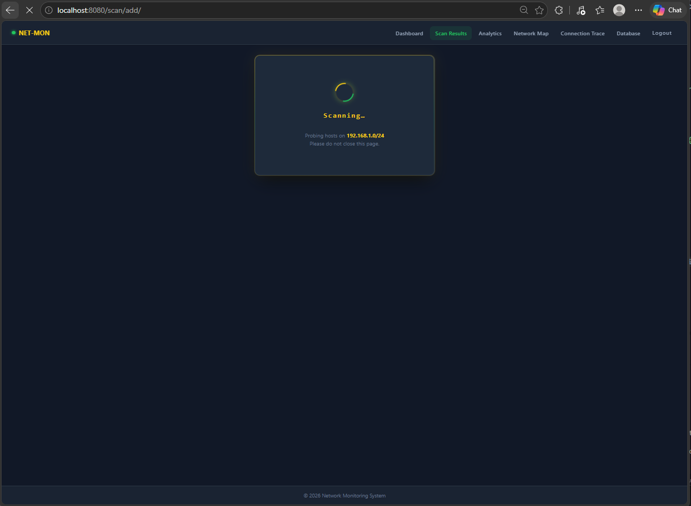
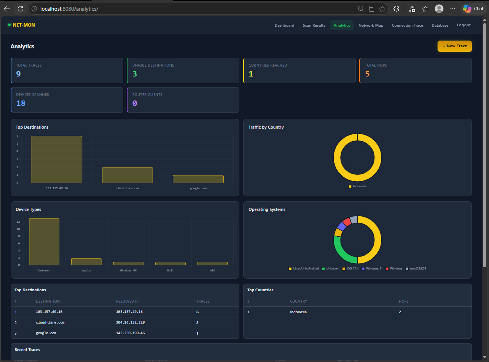
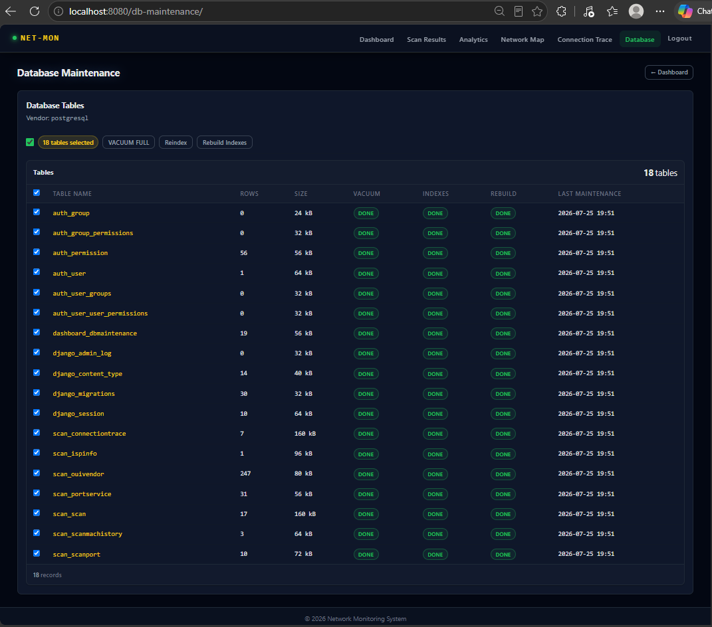

# 🛰️ Django Network Monitoring & Inventory

## 📌 Deskripsi
Aplikasi berbasis **Django** untuk:
- Login & autentikasi user.
- Dashboard monitoring jaringan.
- Network inventory hasil scan (IP, device, OS, brand, gateway, router, DNS, MAC, latency, open ports).
- Peta jaringan interaktif (network mapping).
- Riwayat port dan MAC address perangkat untuk perbandingan antar scan.
- **Analytics** — visualisasi trace koneksi, top destinations, traffic by country, device types, OS breakdown.
- **Connection Trace** — traceroute ke destination dengan peta hop & geolokasi.

## ⚙️ Fitur Utama
- **Autentikasi & Role Management**
  - Login dengan `django.contrib.auth`.
  - Pesan error validasi login.
- **Live Host Discovery**
  - Ping sweep untuk menemukan semua host yang hidup di subnet.
  - Deteksi TTL untuk inferensi OS sederhana.
  - Deteksi interface aktif, gateway, dan DNS server secara otomatis.
  - Mendukung Windows (`ipconfig`, `route print`, `ping -n`) dan Unix (`ifconfig`, `route`, `ping -c`).
- **Port & Service Detection**
  - Scan koneksi TCP pada port umum.
  - Pemetaan port ke layanan (HTTP, SSH, SMB, RDP, dll).
  - Pengukuran latency berbasis port terbuka.
  - **Tabel `scan_port`** untuk menyimpan riwayat port per scan.
- **Device Classification**
  - Inferensi device, OS, dan vendor dari hostname, MAC vendor, TTL, dan open ports.
  - Mendeteksi perangkat tanpa open port (phone, tablet, IoT, PC, server).
- **Inventory Management**
  - Tabel `scan(id, ip, device, os, brand, gateway, router, dns, mac_address, latency_ms, open_ports, services, scanned_at)`.
  - **Tabel `scan_mac_history`** untuk melacak perubahan MAC address per IP dari waktu ke waktu.
  - CRUD untuk data hasil scan.
  - Identifikasi duplikat IP dan MAC.
- **Dashboard Monitoring**
  - Ringkasan jumlah device, distribusi OS & brand.
  - Grafik interaktif dengan Chart.js (doughnut OS distribution, brand distribution).
  - Tabel recent scans dengan pagination.
- **Analytics**
  - Summary cards: total traces, unique destinations, countries reached, total hops, devices scanned, router clients.
  - Bar chart: top destinations, device types.
  - Doughnut chart: traffic by country, OS breakdown.
  - Tabel: top destinations, top countries, recent traces — semua dengan pagination.
- **Network Mapping**
  - Visualisasi topologi jaringan menggunakan vis.js.
  - Node: IP/device. Edge: hubungan ke gateway.
- **Connection Trace**
  - Traceroute ke destination host.
  - Simpan riwayat hop dengan IP, latency, dan geolokasi per hop.
- **Database Maintenance**
  - Tabel semua model dengan VACUUM FULL, Reindex, Rebuild Indexes.
  - Checkbox per tabel / select all.
  - Tampilkan rows, size, status vacuum/index, dan last maintenance timestamp.
- **Auto Setup**
  - `run.sh` / `run.bat` otomatis membuat database, menjalankan migrasi, dan seed data awal.
  - Seed hanya berjalan jika tabel kosong (idempoten).

## 🎨 Tema & UI
- **Dark green-navy theme** — background `#111827`, surface `#1a2332`, card `#1e2a3a`.
- **Aksen kuning/gold** (`#facc15`) untuk tombol, highlight, dan logo.
- **Aksen hijau** (`#22c55e`) untuk status online, nav active, dan badge.
- Navbar sticky dengan logo `NET-MON` + indikator hijau pulsing.
- Card dengan colored left-border per kategori (biru, hijau, kuning, orange, ungu).
- Chart.js bar & doughnut charts dengan palette multi-warna.
- Tombol `+ Run Scan` / `+ New Trace` gold gradient.
- Tabel dengan hover highlight kuning transparan.

## 🛠️ Instalasi & Menjalankan

### Prasyarat
- Python 3.8+
- PostgreSQL 18 (port `5008`)
- Database user: `postgres` / password: `Password09!`
- Database name: `network`

### Windows
Double-click `run.bat` atau jalankan dari PowerShell:
```powershell
.\run.bat
```

### Linux / macOS
```bash
bash run.sh
```

Script akan otomatis:
1. Mengecek dan membuat database `network` jika belum ada.
2. Menjalankan migrasi Django.
3. Melakukan seed data awal (superuser `admin` / `admin123`, data scan contoh, maintenance record).
4. Menjalankan server di `http://127.0.0.1:8080/`.

Login dengan:
- Username: `admin`
- Password: `admin123`

### Manual (opsional)
```bash
python -m venv .venv
source .venv/bin/activate   # Windows: .venv\Scripts\activate
pip install -r requirements.txt
python manage.py migrate
python manage.py seed
python manage.py runserver 8080
```

## 📁 Struktur Project
```
project/
├── apps/
│   ├── scan/           # Model, scanner, view untuk hasil scan
│   │   ├── models.py
│   │   ├── views.py
│   │   ├── urls.py
│   │   ├── admin.py
│   │   ├── scanner.py
│   │   └── management/
│   │       └── commands/
│   │           └── seed.py
│   └── dashboard/      # Dashboard & visualisasi
│       ├── views.py
│       ├── urls.py
│       └── models.py
├── project/
│   ├── settings.py
│   └── urls.py
├── templates/
│   ├── base.html
│   ├── login.html
│   ├── dashboard.html
│   ├── analytics.html
│   ├── network_map.html
│   ├── trace_connection.html
│   ├── router_clients.html
│   ├── scan_list.html
│   ├── scan_detail.html
│   ├── scan_form.html
│   ├── scan_trigger.html
│   ├── scan_confirm_delete.html
│   └── db_maintenance.html
├── static/
│   └── css/
│       └── style.css
├── manage.py
├── run.sh
├── run.bat
└── readme.md
```

## ⚙️ Konfigurasi Database
```python
DATABASES = {
    'default': {
        'ENGINE': 'django.db.backends.postgresql',
        'NAME': 'network',
        'USER': 'postgres',
        'PASSWORD': 'Password09!',
        'HOST': 'localhost',
        'PORT': '5008',
    }
}
```

## 🚀 Workflow
1. Jalankan `run.sh` atau `run.bat`.
2. Buka `http://127.0.0.1:8080/accounts/login/` dan login dengan `admin` / `admin123`.
3. User login → masuk dashboard.
4. Buka **New Scan** → pilih subnet / gunakan auto-detect interface aktif.
5. Sistem melakukan ping sweep, live host discovery, dan port scan.
6. Host tanpa open port tetap terdeteksi menggunakan fallback inference (hostname, MAC vendor, TTL).
7. Dashboard menampilkan inventory & statistik.
8. **Analytics** menampilkan chart trace, destinations, countries, device & OS breakdown.
9. **Network Map** menampilkan topologi interaktif.
10. **Database Maintenance** untuk VACUUM, REINDEX, dan rebuild index per tabel.

## 🔮 Fitur Tambahan (Roadmap)
- Alert & Notifikasi — email/telegram jika ada device baru atau perubahan OS.
- Scheduled Scan — Celery atau django-crontab untuk scan otomatis.
- Export Data — Export hasil scan ke CSV/Excel.
- Integrasi SNMP — Ambil informasi device lebih detail (CPU, memory, interface).
- User Activity Log — Audit trail untuk login & aksi user.
- API Endpoint — Django Rest Framework untuk integrasi eksternal.
- Security Check — Port scan & vulnerability check dasar.
- Multi-subnet Support — Scan lebih dari satu range IP sekaligus.
- Historical Trends — Grafik perubahan jumlah device/OS dari waktu ke waktu.

## 📸 Screenshots

| Login | Dashboard |
|:---:|:---:|
|  |  |

| Scan Results | Scanning Progress |
|:---:|:---:|
|  |  |

| Analytics | Database Maintenance |
|:---:|:---:|
|  |  |

## 📝 Changelog

### 2026-07-25
- **CSS theme overhaul** — diganti dari light/white theme ke dark green-navy theme sesuai Haze dashboard sample:
  - `--bg-root` `#F9FAFB` → `#111827`
  - `--bg-surface` `#FFFFFF` → `#1a2332`
  - `--bg-elevated` `#FFFFFF` → `#1e2a3a`
  - `--text-primary` `#1C252E` → `#e2e8f0`
  - `--accent` blue `#3b82f6` → gold `#facc15` (konsisten dengan tombol dan highlight)
  - Shadow values diperbarui untuk dark background (opacity lebih tinggi).
- **CSS cleanup** — dihapus duplicate `.btn-primary`, `.btn-small`, `.btn-danger` blocks dan orphaned CSS rules tanpa selector yang menyebabkan parse error.
- **Chart box** — background diubah dari `rgba(15,23,42,0.55)` ke `var(--bg-elevated)` agar konsisten dengan card lain.
- **Glass box** — sama, menggunakan `var(--bg-elevated)` dan `var(--border-default)`.
- **Navbar hover** — diubah dari accent-muted ke subtle white overlay untuk kontras yang lebih baik di dark bg.
- **ISP label/value** — duplikat rule digabung menjadi satu definisi bersih.
- **Analytics template** — halaman analytics dengan summary cards, 4 chart (bar + doughnut), tabel top destinations/countries, dan recent traces.

## 🚀 Push ke GitHub
```bash
bash push.sh
```
